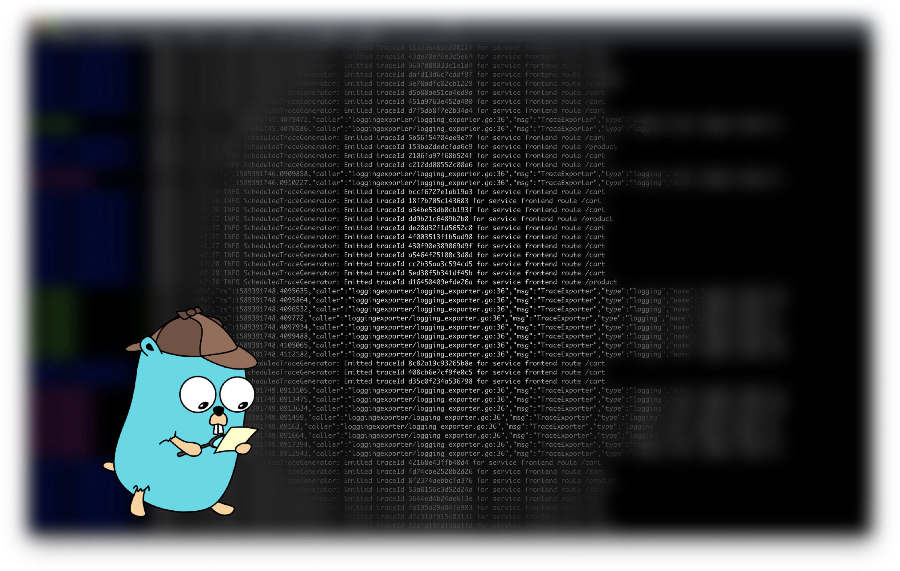

# go-build-versioning

This repo is a supporting code repository for the medium article about injecting the build version into the GoLang Container logs using the GitHub Actions.

The artcile can be found here [GoLang App build version in Containers.](https://medium.com/@github.gkarthiks/golang-app-build-version-in-containers-3d4833a55094)
